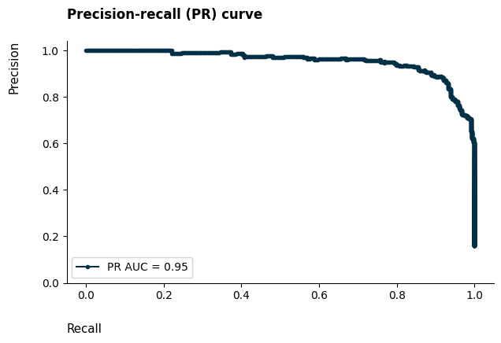

# Bank Customer Churn Prediction

## 1. Description

The purpose of this project is to optimise client retention tactics by utilising machine learning models to anticipate customer attrition for a bank. Through the examination of credit card customer datasets, I created a predictive model that helps me identify customers who are most likely to leave. To identify the variables impacting churn, the project included extensive data preparation, feature engineering, and exploratory data analysis (EDA).

To achieve the main goal, I applied several machine learning models, including Logistic Regression, Random Forest, and LightGBM, optimizing them with Optuna to enhance performance. The models were evaluated using metrics such as precision, recall, F1-score, and AUC. LightGBM proved to be the most effective model for predicting churn.

Additionally, the model's predictions were interpreted using SHAP (SHapley Additive exPlanations), which shed light on the key characteristics that influence churn. Finally, the churn prediction model's financial impact was measured, showing that the bank might benefit financially by $159,157 by enhancing retention efforts.

## 2. Technologies and Methods

- Python (pandas, numpy, matplotlib, seaborn, scikit-learn, optuna)
- Jupyter Notebook
- Preprocessing (feature engineering, feature encoding, feature scaling)
- Machine Learning 
    - Classification (Logistic Regresison, LinearSVC, KNN, Decision Tree, Random Forest and LightGBM)
    - Optmization (Optuna)
    - Performance Metrics (Precision, Recall, F1-Score, ROC)
    - Features Analysis (SHAP)
- Git

## 3. EDA

### 3.1 Dataset

The dataset used was [Credit Card Customers](https://www.kaggle.com/datasets/sakshigoyal7/credit-card-customers?sort=votes).

- CLIENTNUM: Client ID. Categorical nominal.
- Attrition_Flag: Internal event (customer activity) variable - if the account is closed then 1 else 0. Categorical binary.
- Customer_Age: Demographic variable - Customer's Age in Years. Numerical discrete.
- Gender: Demographic variable - M=Male, F=Female. Categorical nominal.
- Dependent_count: Demographic variable - Number of dependents. Numerical discrete.
- Education_Level: Demographic variable - Educational Qualification of the account holder (example: high school, college graduate, etc.). Categorical ordinal.
- Marital_Status: Demographic variable - Married, Single, Divorced, Unknown. Categorical nominal.
- Income_Category: Demographic variable - Annual Income Category of the account holder (<40K - 60K, 80K, 120K, >120K). Categorical ordinal.
- Card_Category: Product Variable - Type of Card (Blue, Silver, Gold, Platinum). Categorical ordinal.
- Months_on_book: Period of relationship with bank. Numerical discrete.
- Total_Relationship_Count: Total no. of products held by the customer. Numerical discrete.
- Months_Inactive_12_mon: No. of months inactive in the last 12 months. Numerical discrete.
- Contacts_Count_12_mon: No. of Contacts in the last 12 months. Numerical discrete.
- Credit_Limit: Credit Limit on the Credit Card. Numerical continuous.
- Total_Revolving_Bal: Total Revolving Balance on the Credit Card. Numerical discrete.
- Avg_Open_To_Buy: Open to Buy Credit Line (Average of last 12 months). Numerical continuous.
- Total_Amt_Chng_Q4_Q1: Change in Transaction Amount (Q4 over Q1). Numerical continuous.
- Total_Trans_Amt: Total Transaction Amount (Last 12 months). Numerical discrete.
- Total_Trans_Ct: Total Transaction Count (Last 12 months). Numerical discrete.
- Total_Ct_Chng_Q4_Q1: Change in Transaction Count (Q4 over Q1). Numerical continuous.
- Avg_Utilization_Ratio: Average Card Utilization Ratio. Numerical continuous.

### 3.2 Steps

#### Target Feature

#### Categorical Features

- Although there are somewhat more women than males among the company's clientele, total customer distribution is equal, even when attrition is taken into account.
- Out of the seven groups, the majority of customers completed their high school education or graduated. Furthermore, we have a minor issue with certain of our consumers whose educational worth is unclear.
- While the majority of clients are married, the singles are rather close. Similar to schooling, we have an issue with unidentified values.
- A minor percentage of the clients have unknown figures for their income, while the majority make less than $40,000.
- The majority of clients own the blue card category.

#### Numerical Features

- The majority of the clientele is middle-aged, ranging from 40 to 50 years old.
- The majority of clients have one or more dependents, usually between two and three.
- The firm had a large number of new users 37 months ago.
- The majority of clients own three or more bank products.
- The majority of clients remain inactive for up to three months.
- The majority of clients make up to three or more contacts.
- While a sizable portion of the clientele have credit limits that are the highest possible, the majority have low credit limits. And, most of them still have available credit.
- The majority of clients have revolving credit.

#### Correlation Matrix

- **Months on Book vs. Customer Age**. We observe a high positive correlation between these two variables because they are time-related. As customers age, the time since they first created an account with the bank increases.
- **Avg Open to Buy vs. Credit Limit**. There is a strong positive correlation between these variables because the average open to buy is directly dependent on the credit limit.
- **Total Transaction Amount vs. Total Transaction Count**. A high positive correlation exists between these two variables. This is because as the number of transactions increases, the total transaction amount also increases.
- **Total Transaction Amount vs. Total Relationship Count**. We find a slight negative correlation between these variables, indicating that customers with a high total transaction amount tend to have fewer bank products.
- **Total Transaction Count vs. Total Relationship Count**. There is a slight negative correlation here as well, suggesting that customers with a high transaction count tend to have fewer bank products. This is expected since the total transaction amount and count are strongly positively correlated.
- **Avg Utilization Ratio vs. Credit Limit**. There is a strong negative correlation between these variables, meaning that higher credit limits are associated with lower average utilization ratios.
- **Avg Utilization Ratio vs. Total Revolving Balance**. These two variables are strongly positively correlated, which makes sense because as a customer uses their credit card more, their revolving balances increase.
- **Avg Utilization Ratio vs. Avg Open to Buy**. We observe a high negative correlation, indicating that a higher average open to buy corresponds to a lower average utilization ratio.

### 3.3 Conclusion

- The bank must keep an eye on the dispersion of the average utilisation ratio. Being right-skewed means that most users don't utilise the service very often. In instance, almost 25% of them have a 0% utilisation ratio. The company must thus create strategies to increase utilisation and, consequently, revenue.
- In the previous 12 months, 90% of the consumers were inactive for one to three months. The bank needs to develop plans to prevent consumer idleness in addition to raising the utilisation percentage.
- 75% of the clients had at least two encounters with the bank in the preceding year. The bank has to be aware of this and enquire as to why customers are calling. Do they have grievances with the credit card provider? If yes, what specific problem is causing them to be unhappy? In proportion to the total number of bank contacts, the churn rate rises monotonically and progressively. Particularly, all customers who made six contacts departed.
- Consumers that leave the company frequently have reduced credit limits, revolving debt, transaction amounts, transaction counts, and average utilisation ratios (many of them have 0% utilisation rates). This makes perfect sense because a customer will do fewer transactions and hence have lower values of these traits when he is ready to stop using the service.

## 4. Classification

### 4.1 Steps

1. Duplicate the dataset to create one version for linear-based models and another for tree-based models.
2. Apply feature engineering to add 21 new features and perform one-hot encoding for categorical variables on both datasets.
3. Scale the features using StandardScaler only for the linear-based dataset to ensure proper normalization.
4. Split the datasets into training and test sets with an 80-20 ratio for consistent model evaluation.
5. Create six models: Logistic Regression, LinearSVC, KNN for linear-based models, and Decision Tree, Random Forest, LightGBM for tree-based models.
6. Optimize each model's hyperparameters using Optuna, conducting 100 trials with 5-fold cross-validation to identify the best-performing configurations

### 4.2 Evaluation

|Model|Precision|Recall|F1-Score|Accuracy|AUC|
|---|---|---|---|---|---|
|Logistic Regression|0.78|0.64|0.70|0.91|0.80|
|Linear SVC|0.79|0.61|0.69|0.91|0.79|
|KNN |0.81|0.62|0.70|0.92|0.80|
|Decision Tree|0.54|0.51|0.52|0.85|0.71|
|Random Forest|0.95|0.80|0.87|0.96|0.89|
|LGBM|0.91|0.86|0.89|0.96|0.92|

The LGBM is the most effective model for this assignment, according on the performance criteria shown in the table. It has the greatest *F1-Score* (0.89), indicating a well-balanced *precision* (0.91) and *recall* (0.86), indicating that it is a reliable model for identifying genuine positives and minimising false positives. It also obtains the greatest *AUC* (0.92), demonstrating its effectiveness in class distinction over a range of decision criteria.

#### 4.1 ROC Curve

#### 4.2 Confusion Matrix

#### 4.3 Precision-Recall Curve

#### 4.4 Predicted Probabilities Distribution

#### 4.5 Predicted Probabilities Deciles

#### 4.6 SHAP values analysis

SHAP (SHapley Additive exPlanations) is a method used in machine learning to explain the predictions made by complex models. It helps you understand how much each feature (input variable) contributes to a model's prediction for a given instance.

This method calculates the impact of each feature on the prediction by comparing what the model would predict with and without each feature. It uses a method inspired by cooperative game theory (Shapley values) to fairly distribute the contribution among all features.

**How SHAP works practically?**

1. Imagine each feature of the model is like a player in a game, and the goal is to make a prediction.
2. SHAP calculates how much each feature "helps" the model to make its prediction by considering all possible combinations of features.
3. It assigns a SHAP value to each feature, which tells you whether it increased or decreased the prediction, and by how much.

By using SHAP, we can answer the question "Why did this model predict that this person will churn?"

In binary classification, results are interpreted using log-odds, which is the logarithm of the ratio between the probability of an event happening versus not happening. Logarithms convert odds to a linear scale. Positive SHAP values increase the log-odds, raising the probability of the event (e.g., churning), while negative SHAP values decrease it.

We can obtain the probability of churning from the log-odds by simply using the logistic function, defined as: 

**P = 1 / (1 + e^−logodds)** 

We will be able to see how each attribute contributes to the prediction for both positive (churner) and negative (non-churner) instances using the waterfall display.

##### 4.6.1. Waterfall

**Nonchurn Customer**

- This customer did not churn, with the estimated probability of churning being approximately 0.0714%.
- We can observe that the number of transactions made in the last 12 months, which is 79 in this case, decreased the log-odds of churning by 1.15. On the other hand, the average amount open to buy, which is $318.00, increased the log-odds of churning by 0.36. 
    - This aligns with our findings that a higher number of transactions lowers the risk of churn, and many churners were concentrated among those with low average open-to-buy values and inactive users for 1 to 3 months.
- Notice how the features created during feature engineering, like *proportion_inactive_months*, *trans_ct_per_ternure* and *trans_ct_per_inactivity*, impacted the log-odds of churning either positively or negatively.

**Churn Customer**

- This customer has churned, with an estimated probability of churning at around 82%, based on the logistic function.
- We can see that the number of transactions, total transaction amount, and total revolving balance have increased the log-odds by 2.05, 1.98, and 1.22, respectively.
    - This aligns with our earlier findings, where a low number of transactions was linked to a higher churn rate. Similarly, a low total transaction amount matches our previous exploratory data analysis (EDA) insights. Lastly, regarding the total revolving balance, we had observed that customers with balances below \$600 or above \$2,400 were more likely to churn

##### 4.6.1. Most important features

We can see which characteristics are most significant using the bar plot. 

The average absolute SHAP value for each feature is plotted below, allowing us to see which features have a greater (positive or negative) impact on the model predictions.

As expected, the number of transactions and the transaction amount in the last 12 months are the most significant features. This aligns with our EDA, where these variables clearly distinguished between churners and non-churners.

Additionally, the features created during the feature engineering phase also ranked among the most important, highlighting the value of this process in enhancing the performance of a machine learning model. Examples include *trans_ct_per_inactivity*, *avg_trans_amt*, *proportion_inactive_months*, and *trans_ct_per_tenure*.

##### 4.6.2 Beeswarm

We can see the link between the characteristics and the model prediction thanks to the beeswarm graphic.

- It is evident that lower transaction counts in the past 12 months positively influence the log-odds of churning, thereby increasing the probability of churn, while higher transaction counts have a negative impact.
- Interestingly, higher average transaction amounts tend to positively affect the log-odds of churning, raising the likelihood of churn, whereas lower amounts generally have a negative impact.

## 5. Financial Results

I quantified the financial impact of the churn prediction model based on a confusion matrix and standard assumptions about credit card fees. Specifically, I focused on the bank's typical revenue stream from collecting fees on revolving debt, using an 18% charge as a benchmark.

To estimate the financial outcomes, I considered three main factors:

- Retention cost per client (false positive): This represents the cost of retaining clients mistakenly identified as churners. I reduced the retention charge to 10%, leading to an 8% revenue loss.
- Revenue loss per churner (false negative): This accounts for the loss of clients not correctly identified as likely to churn, resulting in the loss of the full 18% fee on their unpaid balances.
- Financial gain from correctly predicting a churner (true positive): By retaining customers correctly identified as churners using a 10% charge, the model helped retain both the client and associated revenue.

Based on the model's performance, I projected a financial gain of \$159,157 for the bank.
